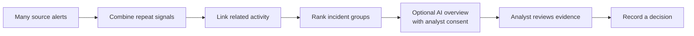
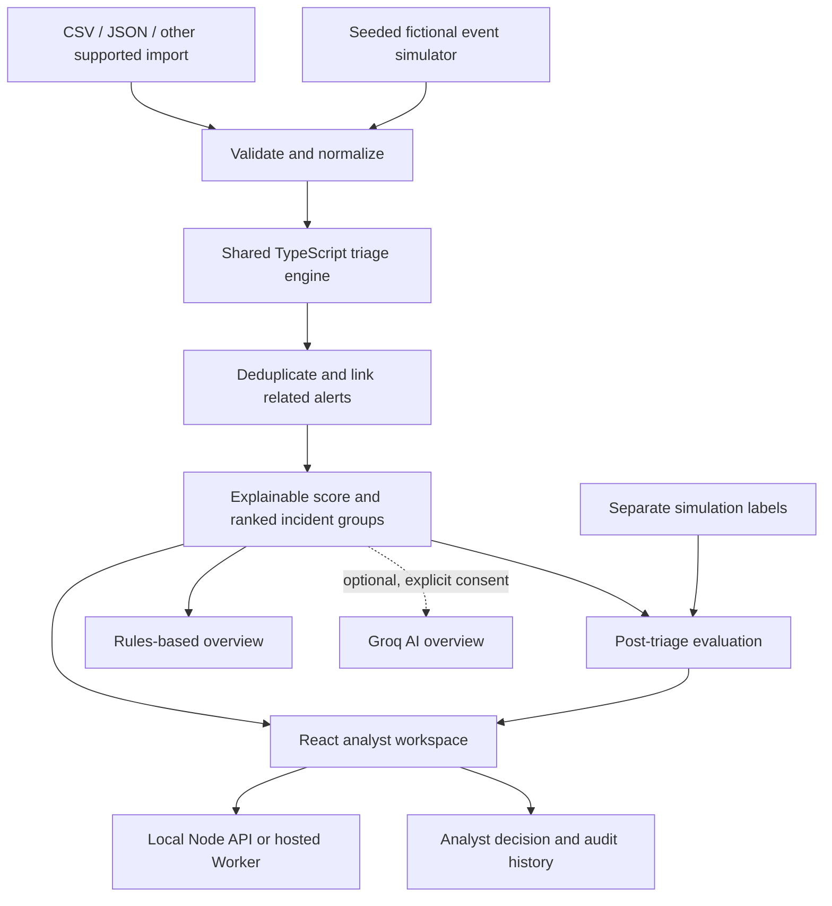

# Utopia Signal · Team 239

**From alert noise to incident groups an analyst can inspect.**

Security operations teams can receive many separate alerts about the same activity. Utopia Signal demonstrates a focused workflow: connect alerts that share evidence, rank the resulting incident groups, and let an analyst inspect why each decision was made.

**[Open the demo](https://utopia-soc-239.sapre-aude33.chatgpt.site)** · **[Five-minute walkthrough](docs/DEMO_SCRIPT.md)** · **[Judge brief](public/judge-brief.md)**

## See the value first



The dashboard makes this change visible: **source alerts → distinct signals → incident groups → a review decision**. Open an alert or a group to see its members, shared users/devices/network evidence, score factors, rank, mapped behavior, and suggested checks. Grouping and risk scores are deterministic and explainable; the optional AI overview can summarize a group from a limited facts packet.

The AI overview is off unless a server-side Groq key is configured and the analyst explicitly consents for that group. Alert descriptions and simulation labels are excluded from the facts packet. Without a key, the rules-based overview works normally.

## Start the demo

The first screen gives two choices: **Start a demo** or **Import data**. A demo run creates a randomized 450–900 fictional alerts over a randomly selected one- or two-hour event window. It then opens the ranked incident groups with a fast replay of those saved alerts.

### Run on this computer

Requirements: Node.js 24 and npm. From PowerShell:

```powershell
git clone https://github.com/aakash-kr-7/ImagineUtopia_3000Alerts.git
cd ImagineUtopia_3000Alerts
npm ci
npm run dev
```

Open [http://127.0.0.1:5173](http://127.0.0.1:5173) and keep the terminal running. Local analyses are stored in `runtime/`.

### Run with Docker Desktop

```powershell
docker compose up --build
```

Open [http://localhost:8000](http://localhost:8000). Docker exposes port **8000** on your computer; port 5173 is internal to the container. Local records persist in a named Docker volume.

### Optional Groq AI overview

The live overview is optional. To turn it on for a local Docker demo, copy `.env.example` to `.env`, add a newly issued Groq key, and start or rebuild the container. `.env` is ignored by Git. The overview sends only the current group's alert IDs, timestamps, behavior types, source/severity values, entity identifiers, score, and technique codes to Groq after the analyst checks the consent box. Alert descriptions, uploaded file bytes, and simulation truth are not sent. The generated prose is not proof of intent; structured IDs and citations are checked, and the analyst remains responsible for interpretation.

For a demo without a provider key, use the deterministic incident overview. Core simulation, grouping, review, import, and evaluation do not require AI.

## Try a realistic public-data example

From **Import data**, download and use [the curated AIT Wazuh CSV sample](public/examples/ait-wazuh-demo.csv). It contains security alerts from the public AIT Alert Data Set, a controlled research testbed distributed under CC BY 4.0. Host names are pseudonymized; raw log text and user/network identifiers are omitted. The CSV is an import example, **not** a held-out accuracy dataset; ATT&CK labels and source evaluation fields are excluded. See [sample provenance and attribution](docs/EXAMPLE_DATA.md).

The importer also accepts supported JSON/JSONL, CSV/TSV, XLSX, searchable PDF, DOCX, TXT, and LOG formats. It previews records, severity conversion, time zones, accepted/rejected rows, and source provenance before analysis. Narrative documents become cited evidence mentions; they are not converted into invented alert timelines. See the [import guide](docs/INGESTION.md) for exact formats and limits.

## What the evidence says

In the project's synthetic fixed-seed holdout at 3,000 alerts, mean **episode Recall@25** is 80.0% for Utopia and 16.7% for severity-only across 20 seeds. This means a simulated campaign appeared in the first 25 ranked review groups; it is not alert-level accuracy or analyst time saved. Grouping F1 is 25.6% under the protocol's pairwise definition. At 10,000 alerts, Recall@25 falls to 48.8%.

These results describe this simulator and protocol. They do not establish real SOC accuracy, production-scale performance, breach prevention, calibrated risk probabilities, time saved, or superiority to a commercial platform. The scale drop and modest grouping F1 are part of the result. Read the [evaluation protocol](docs/EVALUATION_PROTOCOL.md) and [validation record](docs/VALIDATION.md) before reusing a metric.

## What is common, and where this project adds value

| Established security workflow                          | Utopia Signal's focused contribution                                                                                 |
| ------------------------------------------------------ | -------------------------------------------------------------------------------------------------------------------- |
| Security products already group and prioritize alerts. | Show the evidence that links each alert group into an incident.                                                      |
| Analysts investigate alerts and record decisions.      | Let a reviewer open every alert, inspect its rank and score reasons, and record a reasoned human disposition.        |
| Benchmarking compares methods on data.                 | Keep simulation labels outside triage and compare all methods against the same held-out runs and review-item budget. |
| MITRE ATT&CK names observed techniques and tactics.    | Use pinned ATT&CK references as context, not as proof of malicious intent or a universal attack sequence.            |

The defensible contribution is **an inspectable triage experiment with a visible coverage/workload trade-off**, not a claim to invent alert correlation.

## How the parts fit together



**What happens at each step:** the browser previews and normalizes an import; the TypeScript engine groups using typed entities and time; a capped rule-based score ranks each group; the analyst inspects and decides; evaluation reads synthetic labels only after triage. Local Node and the optional FastAPI adapter use the same engine. Docker runs the local, single-workspace appliance. A built Cloudflare Worker adapter is included for hosted deployment.

## Explore the repository

- [Product demo and judge walkthrough](docs/DEMO_SCRIPT.md) · [Judge questions](docs/JUDGE_QA.md)
- [Architecture and trust boundaries](docs/ARCHITECTURE.md) · [Simulation assumptions](docs/SIMULATION.md)
- [Evaluation protocol and metric definitions](docs/EVALUATION_PROTOCOL.md) · [Validation and limits](docs/VALIDATION.md)
- [Import formats](docs/INGESTION.md) · [Public sample provenance](docs/EXAMPLE_DATA.md)
- [Documentation index](docs/README.md) · [Editable pitch deck](docs/UTOPIA_PITCH.pptx)

The product is a research prototype and demonstration. It does not execute attacks or take response actions. Simulation realism is structurally checked but is not fitted to every organization. External AIT data supports a bounded ingestion check only; it does not supply per-alert gold labels for an external accuracy claim.
