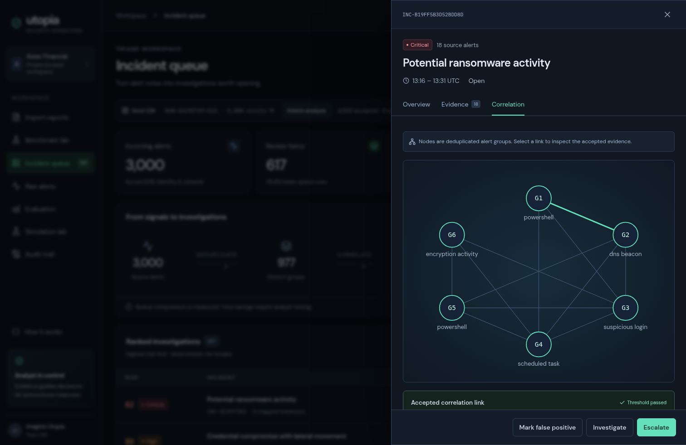
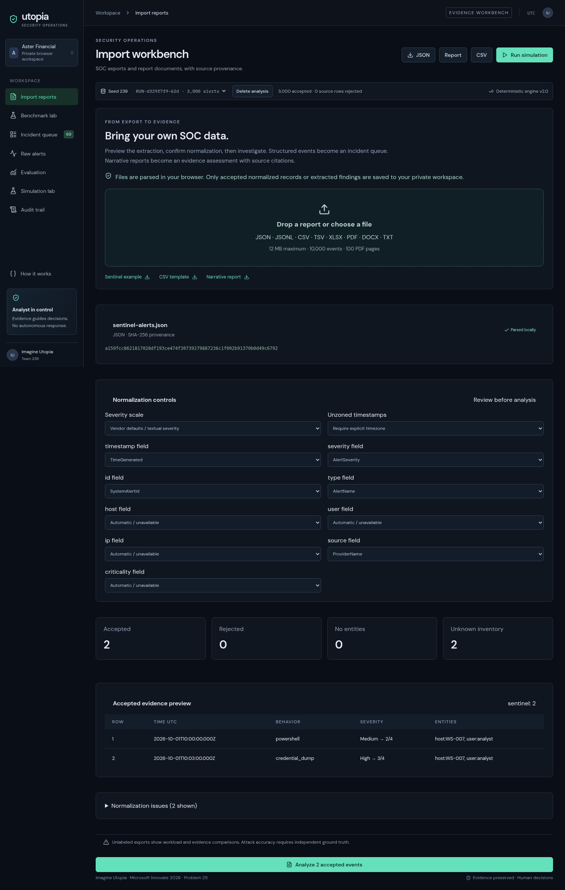
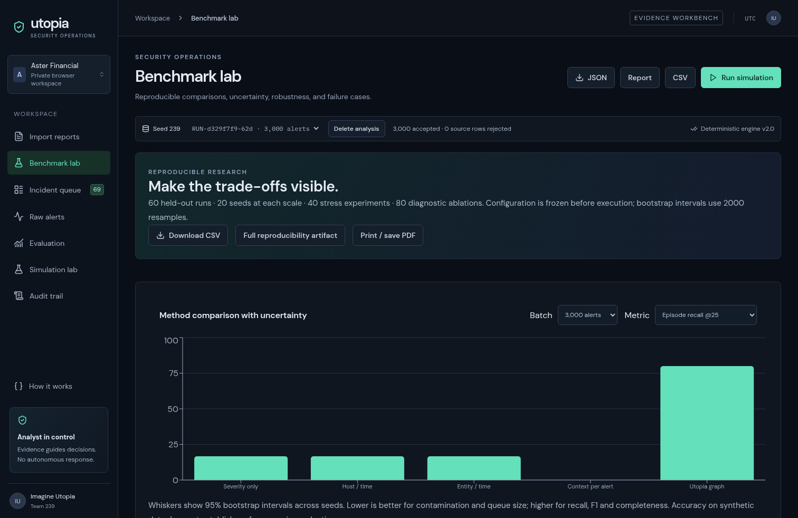
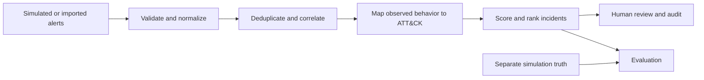

# Utopia Signal — Imagine Utopia · Team 239

**A reviewable alert-triage demonstration for Microsoft Innovate 2026, Problem 25.**

Imagine Utopia turns a busy stream of security alerts into an explainable investigation queue. It combines a seeded telemetry simulator, explicit import workflows, deterministic correlation and scoring, human-reviewed incident decisions, and a reproducible evaluation lab.

The project is designed to make each step inspectable: what evidence was generated or imported, why alerts were grouped, how an incident was ranked, and what the evaluation does—and does not—show.

**[Open the demo](https://utopia-soc-239.sapre-aude33.chatgpt.site)** · **[Judge brief](public/judge-brief.md)** · **[Five-minute walkthrough](docs/DEMO_SCRIPT.md)** · **[All documentation](docs/README.md)**

## See the workbench


| Investigate an incident                                           | Import and review evidence                                 | Compare methods                                     |
| ----------------------------------------------------------------- | ---------------------------------------------------------- | --------------------------------------------------- |
|  |  |  |

## Run locally

Requirements: Node.js 24 and npm. A model-provider key is **not** required to run the app. The landing-page judge brief is a pre-generated, human-reviewed synthesis; user-uploaded reports are not sent to an AI provider, and incident briefs use deterministic templates.

```bash
git clone https://github.com/aakash-kr-7/ImagineUtopia_3000Alerts.git
cd ImagineUtopia_3000Alerts
npm ci
npm run dev
```

Open [http://127.0.0.1:5173](http://127.0.0.1:5173). The first page is a project briefing. Start a simulation to generate a randomized 450–900 alert run spanning one or two simulated hours, or import a reviewer-provided file. No large run is created automatically. Local SQLite data is stored under `runtime/` and excluded from Git.

To build the client and Cloudflare Worker bundle:

```bash
npm run check
npm run build
```

For the optional Python adapter, install `requirements.txt` and run `make demo`; FastAPI is served at [http://127.0.0.1:8000](http://127.0.0.1:8000), with OpenAPI docs at `/docs`. To run the local container, use `docker compose up --build`; it binds to localhost and persists SQLite data in a named volume.

## What you can explore

- **A visible SOC shift:** watch saved alerts replay in event-time order; pause, change speed, filter for review priority, and open individual alerts.
- **Decision explanations:** inspect score components, incident assignment, ranking, linked evidence, ATT&CK mappings, and why an alert does or does not appear in the top review items.
- **Simulation source ledger:** after triage, reveal raw events, alert-to-event links, synthetic labels, scenario stages, inventory, validation output, and SHA-256 hashes.
- **File review:** import JSON/JSONL, CSV/TSV, XLSX, searchable PDF, DOCX, TXT, or LOG. Structured events enter the queue; narrative reports produce cited mentions rather than fabricated alert timelines.
- **Research and comparison:** compare Utopia with fixed educational baselines on the same input; inspect coverage curves, episode visibility, pairwise grouping, benign contamination, and seed-level results.
- **Human decisions and audit:** record a reasoned disposition, inspect the append-only application audit trail, and export JSON, CSV, or a printable HTML report.

## What the evidence says

In the committed **synthetic holdout** experiment at 3,000 alerts, mean episode Recall@25 is **80.0%** for Utopia and **16.7%** for the severity-only baseline across 20 fixed seeds. Utopia grouping F1 is **25.6%**, and benign contamination is **3.7%** under the protocol's definition. At 10,000 alerts, mean Recall@25 is **48.8%**.

These results describe this simulator and its fixed protocol. They are not external SOC accuracy, breach prevention, calibrated probabilities, analyst time saved, or a comparison against commercial security products. MITRE ATT&CK mappings identify observed behavior; they do not establish attacker intent. The app does not perform autonomous response.

For the protocol, metric definitions, raw results, public-data check, and caveats, see [Evaluation protocol](docs/EVALUATION_PROTOCOL.md), [Validation record](docs/VALIDATION.md), and [Primary sources](docs/SOURCES.md).

## How it works



The operational engine receives alerts, not simulation truth. Evaluation runs after triage; a completed run's source ledger is a separate, explicit post-run review. Correlation and risk scores are deterministic and bounded. The optional model-brief adapter is not enabled in the live dashboard; no external AI provider is called by default.

## Repository guide

| Area                                      | Start here                                                                            |
| ----------------------------------------- | ------------------------------------------------------------------------------------- |
| Documentation index                       | [docs/README.md](docs/README.md)                                                      |
| Judge-ready project analysis              | [public/judge-brief.md](public/judge-brief.md)                                        |
| AI analysis process and source provenance | [docs/AI_SOURCE_ANALYSIS.md](docs/AI_SOURCE_ANALYSIS.md)                              |
| Walkthrough and judge Q&A                 | [DEMO_SCRIPT.md](docs/DEMO_SCRIPT.md) · [JUDGE_QA.md](docs/JUDGE_QA.md)               |
| Architecture and trust boundaries         | [ARCHITECTURE.md](docs/ARCHITECTURE.md)                                               |
| Simulation contract                       | [SIMULATION.md](docs/SIMULATION.md)                                                   |
| Import formats and provenance             | [INGESTION.md](docs/INGESTION.md)                                                     |
| Metrics and benchmark design              | [EVALUATION_PROTOCOL.md](docs/EVALUATION_PROTOCOL.md)                                 |
| Validation evidence and limitations       | [VALIDATION.md](docs/VALIDATION.md)                                                   |
| Requirements mapping and sources          | [REQUIREMENTS_MATRIX.md](docs/REQUIREMENTS_MATRIX.md) · [SOURCES.md](docs/SOURCES.md) |
| Editable pitch                            | [UTOPIA_PITCH.pptx](docs/UTOPIA_PITCH.pptx) · [PDF](docs/UTOPIA_PITCH.pdf)            |
| Contributor workflow                      | [CONTRIBUTING.md](CONTRIBUTING.md)                                                    |

Implementation map: `core/` contains the TypeScript contracts, triage, simulation, ingestion and evaluation logic; `app/` contains the React workbench; `server/` contains the API, storage and runtimes; `backend/` is the FastAPI adapter; `experiments/` and `scripts/` hold the fixed protocol and reproducibility tools; `tests/` contains automated checks.

## Scope and limitations

This is a research prototype and demonstration, not a production SIEM/SOAR replacement. The simulator is structurally validated but is not a model of every organization's event distribution. Scanned PDFs require OCR or a searchable export; arbitrary proprietary telemetry is not claimed as universally supported. Public-data validation measures ingestion and observable workload only, not external attack accuracy. Read [the full limitations and validation record](docs/VALIDATION.md) before reusing benchmark claims.
