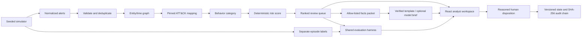

# Architecture and trust boundaries

The engine takes `Alert[]` only. `core/engine.ts`, `contracts.ts`, `mapping.ts`, and `brief.ts` do not import simulator/evaluation modules. The CLI dynamically loads the simulator or evaluator only for those explicit commands. The server orchestration creates labels and calls evaluation **after** triage returns. Operational JSON and the full synthetic source ledger occupy different tables. The owner-scoped source route discloses the ledger only after the run has completed and the reviewer explicitly opens it. This is a post-run research view, not runtime access by the triage engine, and is not a claim that server administrators cannot read the database.

One canonical TypeScript core serves local Node and Cloudflare Worker execution. The FastAPI adapter validates inputs with Pydantic and invokes that same engine in a subprocess. This is a deliberate implementation change from the proposal's Python/NetworkX core: one implementation makes deployed and local scoring easier to reproduce. SQLite is native locally and D1 on Sites. The frontend receives only incident/evidence views and already-computed evaluation output.

## Correlation

Deduplication key: source, alert type, asset criticality, and sorted typed entities. A group may grow only within **120 seconds of its first alert**. All member IDs, descriptions, raw references, and earliest/latest timestamps are preserved. Input timestamps normalize to UTC before sorting.

For each typed entity, candidate pairs are restricted to a time window. Host: 1,800s; user: 2,400s; IP: 600s. Let `n` be group count and `f(e)` be the number of groups containing entity `e`:

`IDF(e) = ln(1 + n/f(e)) / ln(1+n)`

`w(i,j,e) = base(type) × IDF(e) × exp(-gap/tau(type))`

Base weights: host 1.15, user 1.20, IP 0.45. Tau: host/user 1,800s, IP 600s. Sum shared-entity weights for each candidate pair; accept at **0.52**. Candidate links are sorted by descending weight and stable IDs. A constrained union accepts a merge only when total component span is at most four hours and combined size is at most 120 groups. Blocked-link counts, reasons and up to 50 examples are retained; every alert still belongs to exactly one incident. These limits are explicit frozen heuristics, not learned communities. Each edge retains its contributing entity, time gap, IDF, unrounded contribution, summed weight, and threshold. Components above 100 groups are flagged. Component constraints can fragment genuine campaigns; the ablation and replay experiments quantify that trade-off.

Upper-bound pruning omits groups/pairs whose maximum possible undecayed shared-entity weight cannot reach the threshold; this does not remove any accepted link. Dense batches are rejected explicitly after 500,000 candidate comparisons or 40,000 stored candidate pairs. These bounds protect the hosted memory/compute budget; they do not silently discard evidence.

## Score

| Component | Rule | Cap |
| --- | --- | --- |
| Severity | Maximum severity / 4 × 25 | 25 |
| Asset | Maximum known criticality / 4 × 25; missing inventory contributes 0 | 25 |
| Progression | 4 × distinct mapped tactics + 9 if a later alert follows tactic order | 25 |
| Accumulation | 2 × (deduplicated groups − 1) | 10 |
| Spread | 2 × (distinct hosts/users − 2), floored at 0 | 10 |
| Sensitive behavior | Credential access, exfiltration, or impact mapped | 5 |

Tier thresholds: critical ≥80, high ≥60, medium ≥35, otherwise low. Sort score descending, first timestamp ascending, then incident ID. Scores are capped review signals, not learned probabilities. The progression heuristic is deliberately limited; ATT&CK tactics are not a universal attack ordering.

## Decisions and integrity

Actions require a reason, expected incident version, and idempotency key. Audit append and incident-state update occur in one transaction/batch. The append checks the latest chain head and incident version; unique indexes prevent duplicate sequence/idempotency entries. A stale writer receives 409. Hash input uses canonical sorted JSON of the run, sequence, incident, actor, timestamp, disposition, reason, previous hash, version, and idempotency key. Chain verification checks sequence continuity, links, and recomputed SHA-256. A failed chain pauses writes.

A database administrator could rewrite the entire chain and head. External anchoring and independent audit storage are future work. Trusted Sites identity headers are SHA-256 hashed and namespaced. Anonymous visitors receive a random 256-bit HttpOnly/Secure/SameSite=Lax capability cookie; its hash, with a distinct guest namespace, scopes storage. No shared anonymous owner exists. Local development uses one local analyst identity. Public write requests check Origin; session quotas, deletion and lazy 30-day expiration cleanup bound normal use. Clearing an anonymous cookie loses access. Deliberate identity rotation can bypass per-session quotas; this is not a complete internet abuse-control system.

## Briefs

Descriptions are not forwarded to the optional provider. The facts packet contains controlled behavior keys and validated scalar fields. The provider receives no tools, truth labels, or write capability. Objective checks verify schema/size, scalar facts, citation existence, entity/technique membership, and allowed action vocabulary. One retry is allowed, followed by a deterministic template. These checks do not certify the semantic truth of every prose statement. The live app uses templates, so it has no external-model dependency.

## Ingestion and privacy

Browser-only file readers produce either strict operational alerts with source provenance or a bounded narrative evidence assessment. Office ZIP/size/XML limits and local PDF workers constrain extraction. The server validates all submitted values and import totals. Raw bytes never reach the server. Evidence reports remain owner-scoped and are excluded from source archives and CI artifacts. D1 sealed labels are evaluation-only; importing independent truth does not rerun or alter triage.

## Resource behavior

Entity indexing and timestamp-window scans avoid an unconditional all-pairs graph. Dense input still has a quadratic worst case, so exact upper-bound pruning and fixed comparison/pair budgets reject abusive cases explicitly. Union-find uses path compression; strongest-edge ordering is deterministic. Dedup retains all source records and does not include severity in its key, preventing changing duplicate severity from inflating accumulation. Scores use maximum source severity after grouping. Runtime diagnostics include candidate comparisons, stored pairs, blocked merges and largest component.

## Deployment

React static assets, browser PDF module workers and the operational fetch handler are packaged into a deployable Sites Worker with D1 migrations. The actual built Worker is exercised against a SQLite-backed D1 shim before publication, checking guest isolation, private reads, cookie replay, module MIME, CSP, origin checks and deletion. A public audience makes the interface discoverable; it does not make each workspace's records public. `docker-compose.yml` intentionally exposes the single-user local appliance on localhost only. GitHub CI runs formatting, TypeScript, unit/API/Python tests, build checks and browser flows.
