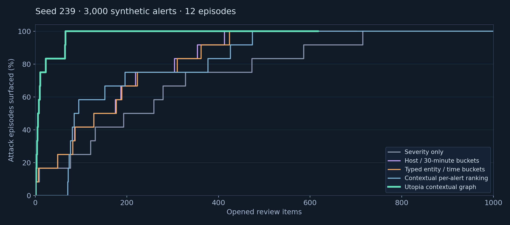
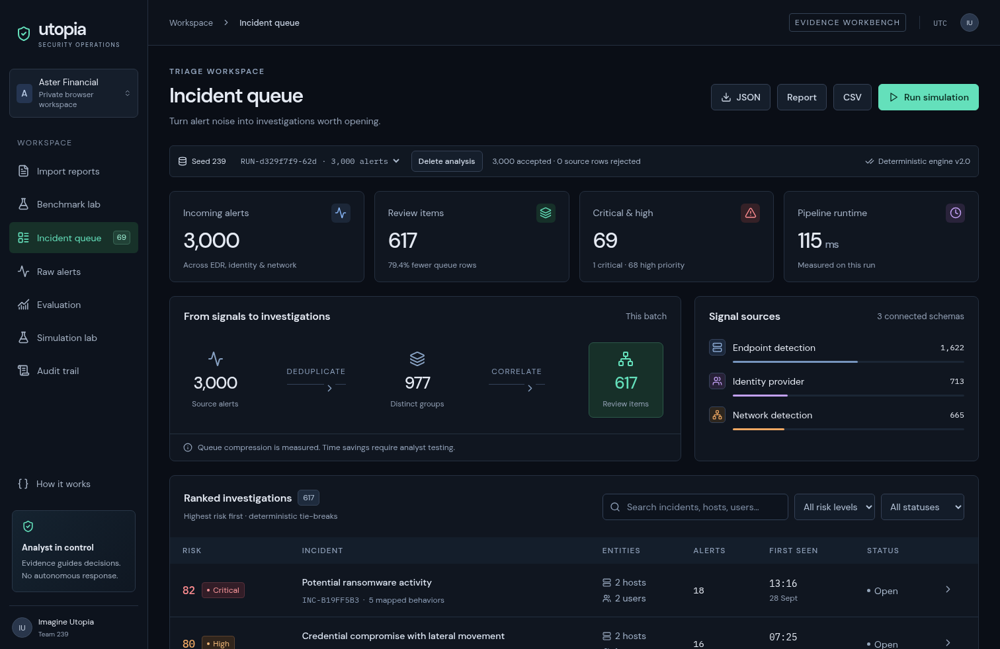

# Documentation guide

Use this page to find the right level of detail. The root [README](../README.md) is the product overview and local quick start; the documents below describe the implementation, evidence, and presentation boundaries.

## Build, run, and present

| If you need to… | Read |
| --- | --- |
| Get the five-minute demo flow | [DEMO_SCRIPT.md](DEMO_SCRIPT.md) |
| Prepare judge answers and caveats | [JUDGE_QA.md](JUDGE_QA.md) |
| Understand how the components fit together | [ARCHITECTURE.md](ARCHITECTURE.md) |
| See which supplied requirements map to implementation | [REQUIREMENTS_MATRIX.md](REQUIREMENTS_MATRIX.md) |
| Present the editable deck or its PDF export | [UTOPIA_PITCH.pptx](UTOPIA_PITCH.pptx) · [UTOPIA_PITCH.pdf](UTOPIA_PITCH.pdf) |

## Product and engineering contracts

| Topic | Document |
| --- | --- |
| Synthetic event generation, sealed labels, scenario assumptions | [SIMULATION.md](SIMULATION.md) |
| Accepted file types, normalization, provenance, and known limits | [INGESTION.md](INGESTION.md) |
| Correlation, scoring, storage, and trust boundaries | [ARCHITECTURE.md](ARCHITECTURE.md) |
| MITRE ATT&CK version, adapter references, and research provenance | [SOURCES.md](SOURCES.md) · [attack-reference.json](attack-reference.json) |

## Evidence and evaluation

| Topic | Document or artifact |
| --- | --- |
| Fixed seeds, baselines, definitions, and uncertainty | [EVALUATION_PROTOCOL.md](EVALUATION_PROTOCOL.md) |
| Validation performed and validation still missing | [VALIDATION.md](VALIDATION.md) |
| Requirements-to-code evidence map | [REQUIREMENTS_MATRIX.md](REQUIREMENTS_MATRIX.md) |
| Reproducible committed evaluation output | [demo-evaluation.json](demo-evaluation.json) |
| Coverage curve |  |
| Dashboard screenshot |  |

## Claim boundaries

Benchmark results are synthetic unless a document explicitly says otherwise. Recall@K measures whether a simulated episode appears in a ranked review prefix; it does not establish breach prevention or analyst detection time. ATT&CK mappings name observed behavior, not intent. The external-data check measures ingestion and observable workload and does not provide external attack accuracy. See the protocol and validation record before quoting a number.
